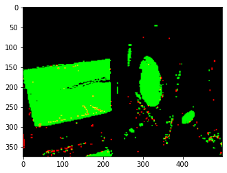
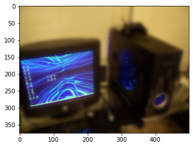

# Segmented Image Blurring

## Abstract

To continue our understanding of deep learning with images, we wanted to create an application that can perform blurring on camera input, blurring unidentified objects in the background. We trained encoders and decoders to take an image and produce a mask. We then created a program that can use our model and blur the background of webcam images by creating a segmentation mask.

## Problem Statement

We wanted to make a program that would use semantic segmentation to allow the user to effectively apply filters to specific objects in an image or video.

## Related Work

For this project, we wanted to experiment with semantic segmentation and some practical applications of it. We decided to create and train our own model to get a better grasp of how the models work. We looked at this paper on semantic segmentation that was recommended in class: (https://arxiv.org/pdf/1505.04366.pdf), and implemented the described network. This network was originally trained in 2 parts, training the encoder and then training the decoder so we experimented with training in one part to save time.

We also looked at the DeepLabv3 but the time required to train another model was too significant so we tried using the pretrained DeepLabv3 with our implementation instead.

## Methodology

We split the project into 4 parts that could be worked on by each member of the group. The parts include pre-processing the data, creating and training a model, blurring an image given a mask, and creating an application that can take in camera input, using our model, and blur the background in real time.

### Pre-processing the data:

For our data, we used Pytorch’s Pascal VOC Dataset, training with year=2012. This produces an image of variable size as the data and a label that is a PNG. In order to train our model, we needed to resize every image. We ended up using cv2’s resize method to make the image be of the size necessary for the model. The label

### Creating the model:

Our model is based on VGG-16 for the convolutional part of the network. We then use unpooling and reversed the network to get the deconvolutional network. For the loss function, we used cross entropy loss. We used 5 sets of convolutional layers, with the first 2 being composed of 2 convolutions and the last 3 using 3 convolutional layers.

### Blurring an image using a mask:

Once we had the model, we would take an input image and process it using the model to get a mask which we could then use to blur the original image. To make the blurred image, we had to make three intermediary images to create the final blurred image. First, we made a second mask by using the mask from the model prediction to set all background pixels of the original image to black and all objects to white pixels. Second, we blurred the entire original image. Using the second mask, blurred image, and the original image. We layered the blurred image and original image everywhere the second mask had a black pixel thus creating a final image which is only blurred on background pixels.

### Developing an app to blur in real-time:

We used cv2 to obtain each frame captured from a video camera. From this we were able to take each captured frame, preprocess it to fit the model, blur the frame and then redisplay the new blurred version of the captured frame.

## Experiments/Evaluation

While training our model, we only evaluated loss and not accuracy, calculating accuracy exceeded our VRAM when training. Our training loss averaged around 1.0 towards the end. We trained our model with 100 epochs and ended up with a test accuracy of 5%. To evaluate our accuracy, we used the technique of intersection over union. The better way for us to evaluate the model was to load the model into our program and see how effective it is with our own images. This is shown in our demo.

## Results

As mentioned above, our average training loss was around 1.0 and both our training and testing accuracy was 5%. This is to be expected as many of the other segmentation networks we have learned about took a couple days to train on significant hardware and we were not able to train for nearly as long. Our image blurring was able to work relatively successfully as it did seem to be able to create masks of faces.

Example results

Original image: 

Mask image produced by the model:

Blurred image:

## Examples

Demo video with our model: [https://www.youtube.com/watch?v=dSxqTCrftx8](https://www.youtube.com/watch?v=dSxqTCrftx8)

## Video Presentation

Video presentation: [https://www.youtube.com/watch?v=inp2lzBVVgE](https://www.youtube.com/watch?v=inp2lzBVVgE)
